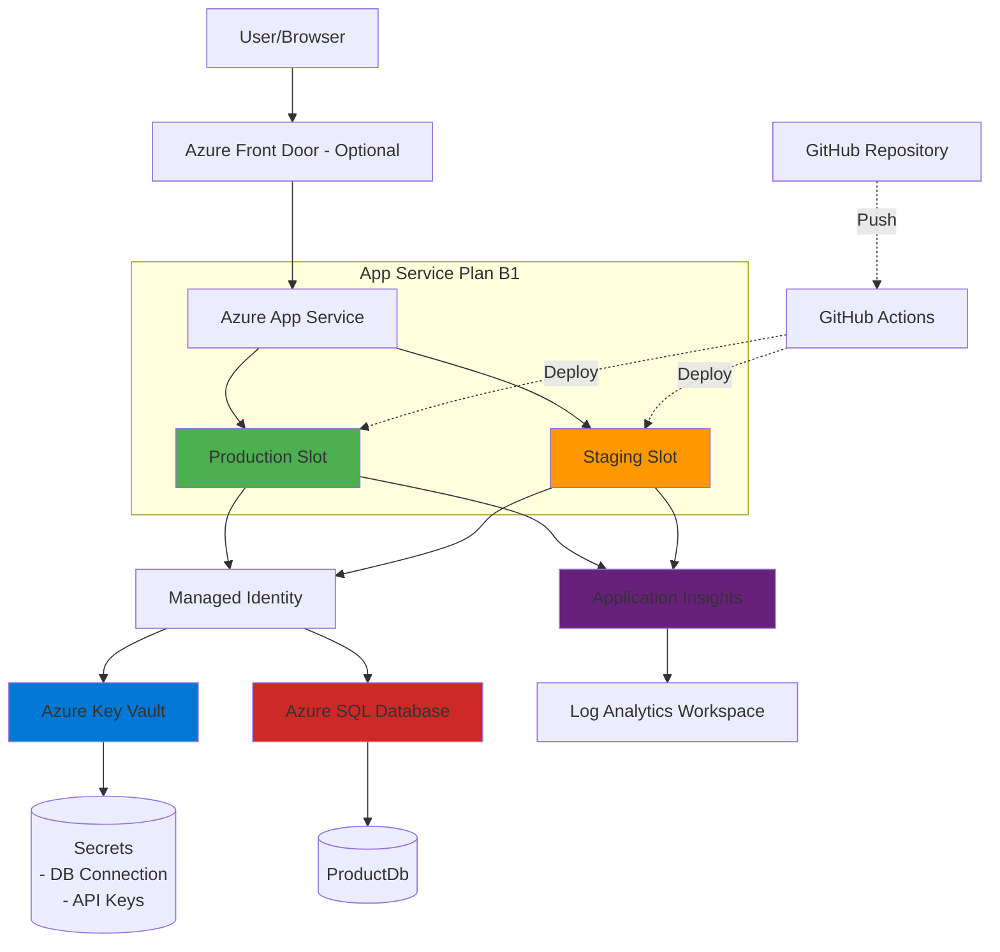
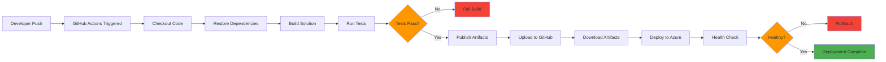
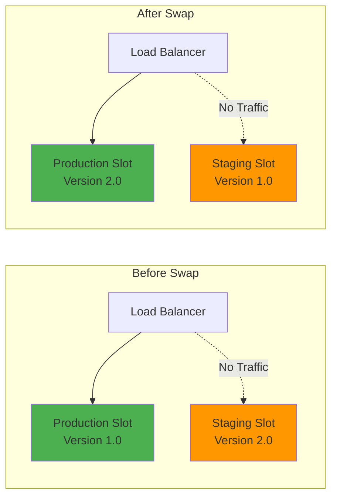
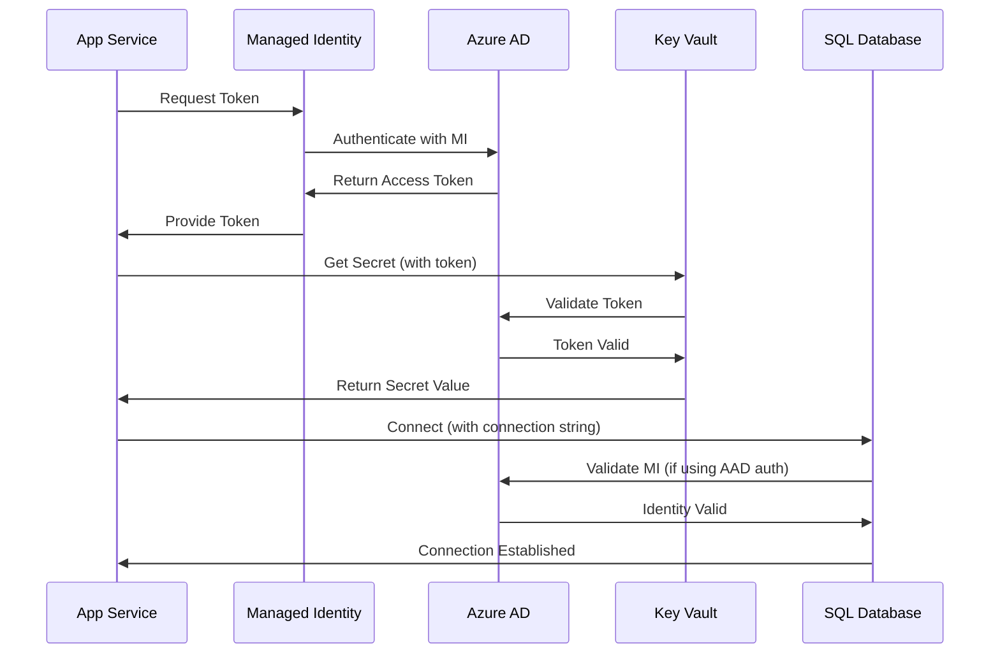
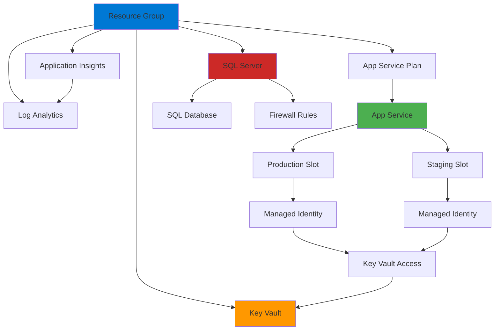
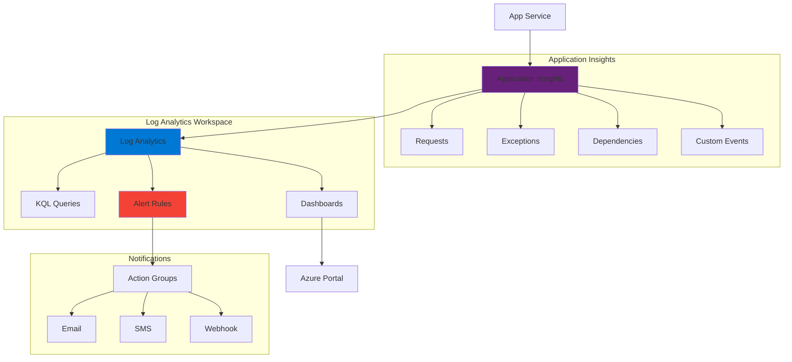
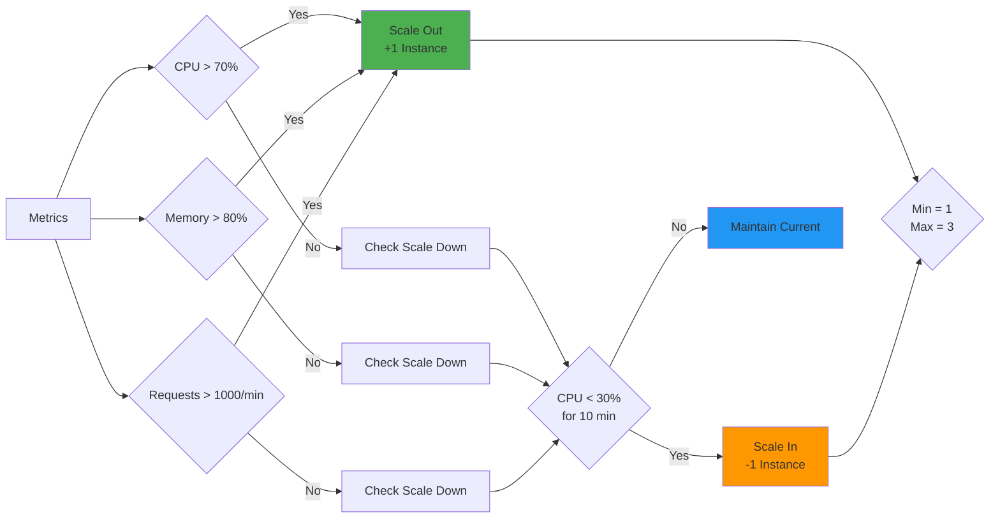
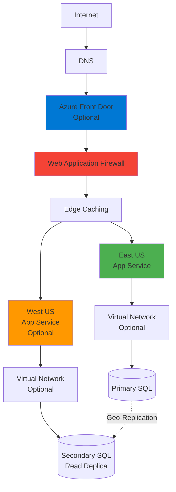
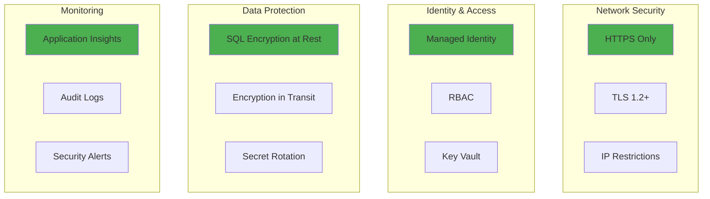

# Architecture Diagrams

## Overall Azure Architecture

## CI/CD Pipeline Flow

## Blue-Green Deployment

## Authentication Flow (Managed Identity)

## Resource Dependencies

## Monitoring & Logging

## Scaling Strategy

## Network Architecture (with Optional Front Door)

---

## Cost Breakdown (Monthly Estimates)

| Resource | SKU | Estimated Cost |
|----------|-----|----------------|
| App Service Plan | B1 | $13.14/month |
| Azure SQL Database | Basic (2GB) | $4.90/month |
| Key Vault | Standard | $0.03/10k ops |
| Application Insights | First 5GB | Free |
| Log Analytics | First 5GB | Free |
| **Total** | | **~$18-20/month** |

### Scaling Costs

| Tier | Monthly Cost | Use Case |
|------|--------------|----------|
| F1 (Free) | $0 | Dev/Test only |
| B1 (Basic) | $13 | Small apps, staging |
| S1 (Standard) | $70 | Production, autoscale |
| P1V2 (Premium) | $146 | High performance |

---

## Security Layers

